# Análisis de la imagen de un VPS

## Verificamos la Firma

Para asegurarnos que la imagen no ha sufrido desperfectos durante su obtención deberemos siempre de verificar su integridad mediante su firma, para ello haremos uso del siguiente comando y archivos.

```bash
openssl dgst -sha256 -verify publica.pem -signature firma.bin balatro_backup.img.gz
```

El resultado que nos da es "Verified OK" por lo tanto podemos continuar, el siguiente paso es descomprimir el archivo.

```bash
gunzip balatro_backup.img.gz
```

Esto nos va a devolver el archivo balatro_backup.img en el mismo directorio.

## Autopsy

Haremos uso de una herramienta llamada Autopsy, en su versión 4.22.1, para ello en la terminal de ubuntu en este caso, podría ser en kali también, simplemente lo ejecutamos llamándolo no es ningún comando complicado.

```bash
autopsy
```
Esto nos va a abrir la interfaz del programa, el cual nos pide que creemos un caso o abramos otro antiguo, lógicamente lo que necesitamos en este momento es crear uno nuevo asi que elegimos esa opción.

Nos va a pedir:

- Nombre del caso
- Numero y nombre de Host del caso
- Carpeta en la que localizar todos los archivos del "proyecto" que creamos

Una ves hecho este proceso, el siguiente paso es añadir una fuente de información, en este caso la antes nombrada imagen del vps ya descomprimida, aportaremos el path a la misma y dejaremos que la aplicación haga su magia mostrándonos toda la información que esta contenía.

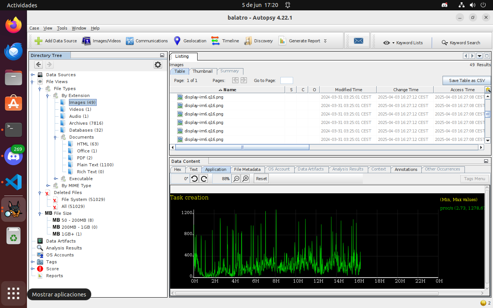

Como podemos observar en esta versión de la aplicación te muestra todos los archivos disponibles incluso los eliminados de una manera muy clara y sencilla que cualquier persona podría entender de manera bastante intuitiva.

## Análisis

Sabemos de antemano que en este vps se han hecho una serie de acciones que deberemos de descubrir mientras investigamos, sabemos que se debía:

- Crear un nuevo usuario y proporcionarle una contraseña al mismo
- Accediendo a ese usuario el investigado debería de crear un archivo flag en un directorio relativamente escondido pero visible
- Crear un archivo .secret (oculto) en otro directorio relativamente escondido
- Crear 2 directorios, uno llamado trabajo y otro llamado pruebas
- Descargar al menos 10 archivos de cualquier tipo en la carpeta pruebas, pasarlos todos a la de trabajo y luego eliminar al menos 5 de ellos
- Seguidamente debía de volver a root, instalar al menos 10 programas y ejecutar alguno
- Crear dos usuarios más, invitado y dev
- Dar permisos de sudo al usuario dev y borrar archivos del sistema al azar

Esto debería de darnos bastante trabajo, o eso pensé antes de descubrir la gran funcionalidad que posee esa versión de Autopsy, "Timeline"

Esta funcionalidad nos permite ver en orden cronológico toda actividad que ha ocurrido en la imagen que hemos montado para analizar, aquí te lo muestro.

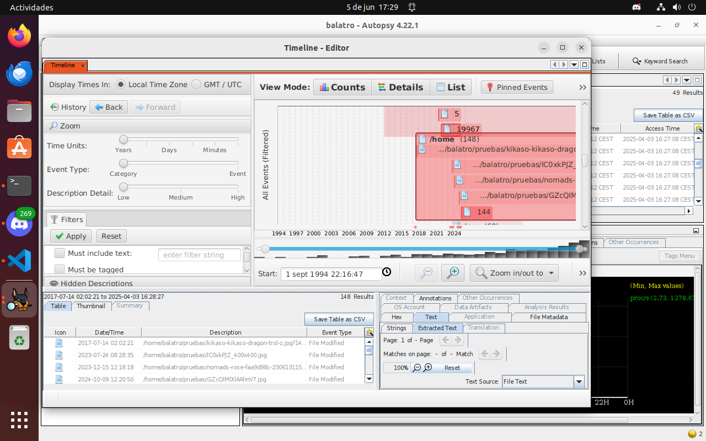

Dentro de timeline he ido investigando hasta que he dado con un bloque bastante sospechoso que ya no me cuadraba que fuesen archivos base del sistema ni configuraciones de linode ni nada por el estilo, lo he pinneado y me dispongo a analizarlo.

### Timeline

Voy a ir checkeando todas las acciones antes mencionadas que vaya encontrando en este bloque sospechoso.

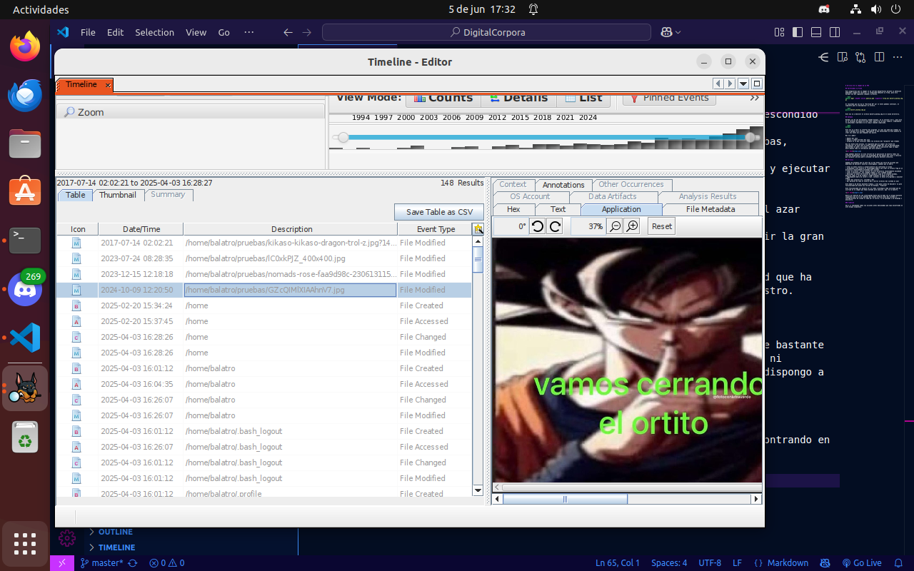

El bloque estaba localizado como se puede ver en la captura anterior a esta en la línea que correspondía con 2018 porque es cuando una de las fotos que el investigado añadió fue creada, sin embargo ahora podremos ver en las siguientes acciones la fecha exacta en la que todo esto ocurrió

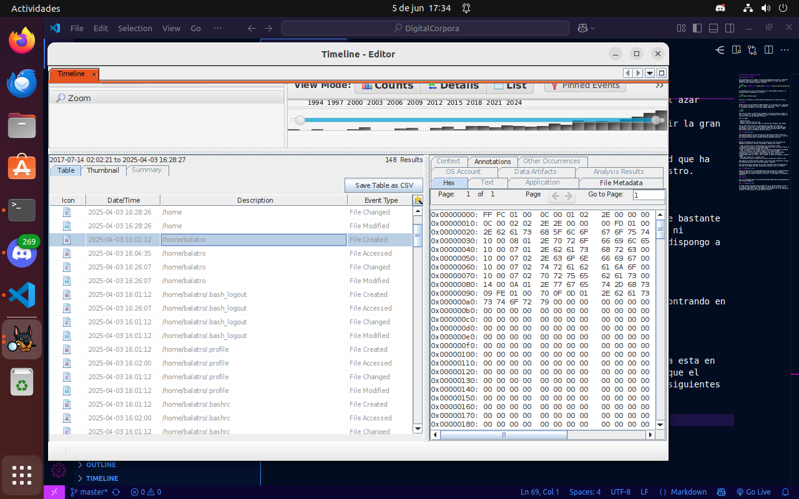

El usuario que fue creado se llama "balatro" y tiene fecha de 3 de abril de 2025 a las 16:01:12 pm

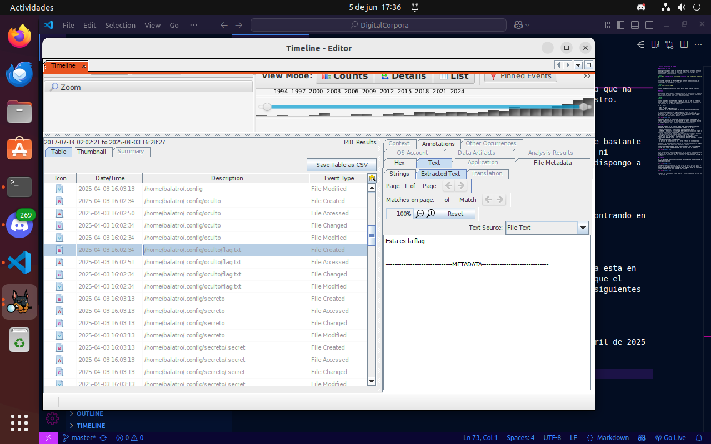

Lo siguiente que podemos comprobar es que esta persona creo dos directorios para nada dificiles de encontrar por sus nombres tan obvios, uno llamado oculto y otro llamado secreto, en los que metio el archivo "flag.txt" y ".secret" respectivamente

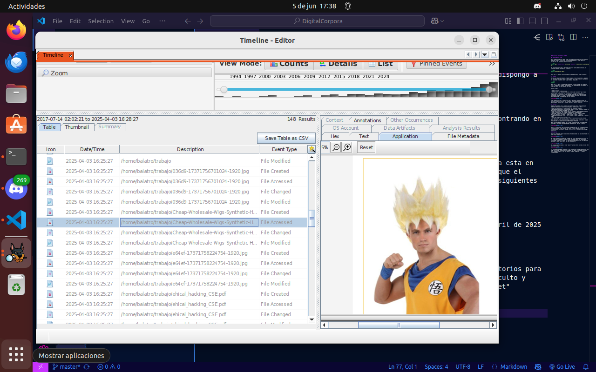

A continuación podemos ver como creó el directorio de trabajo a las 16:03:17 del mismo día pero la ultima vez que fue modificado fue a las 16:25:17 y comenzó a rellenarlo de archivos aleatorios para nada graciosos que venían de la carpeta de pruebas, creada a la misma hora.

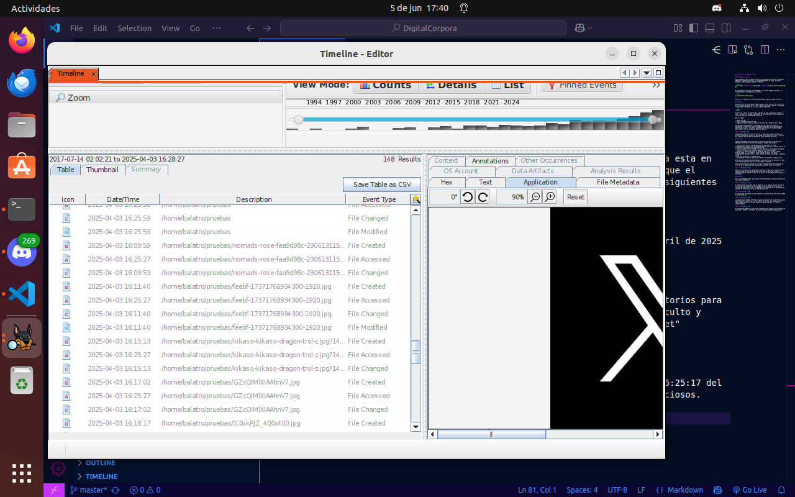

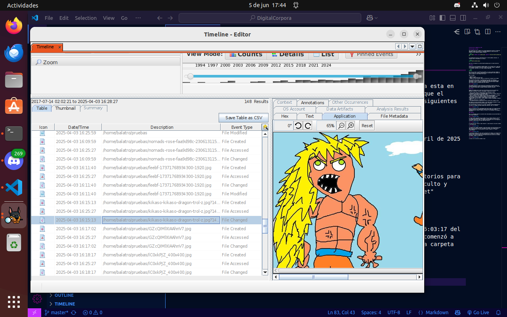

Podemos ver las horas a las que se descargaron los archivos en la carpeta de pruebas y las horas a las que se pasaron a la carpeta de trabajo en conjunto.

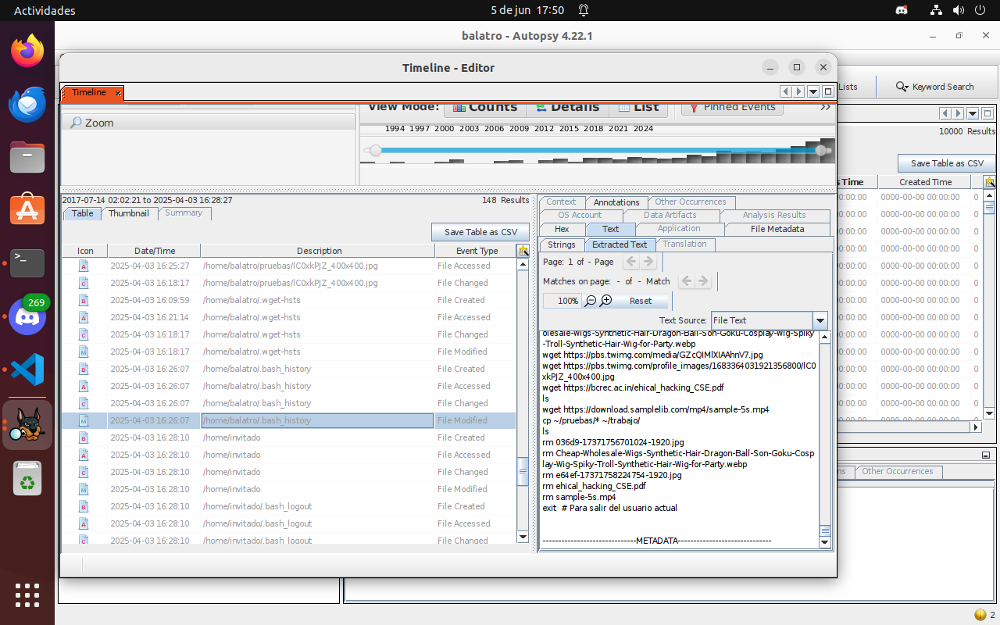

En esta captura podemos ver que tenemos el bash history de este individuo, sabemos cuales son los 5 archivos que borro de trabajo, sabemos cuando creo el usuario de invitado y el de dev

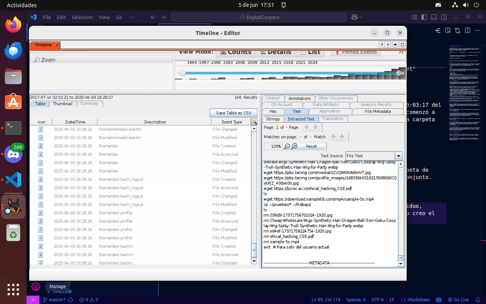

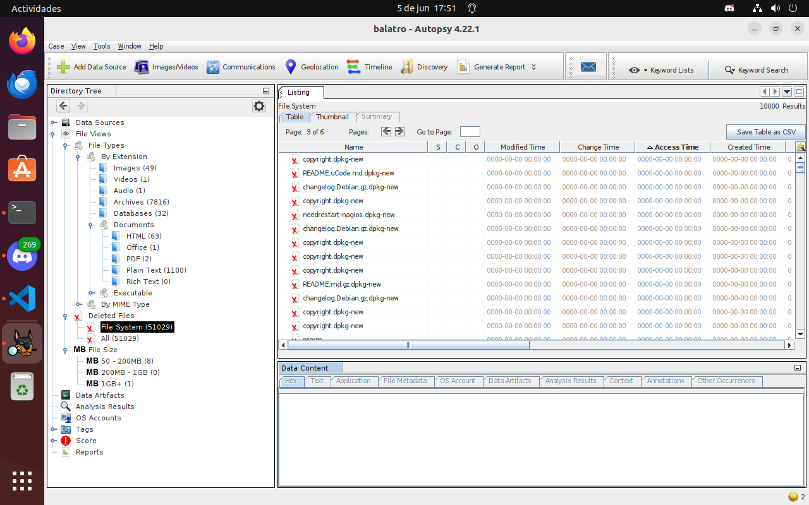

Viendo esta última captura podemos imaginarnos que esta persona de las cosas que decidió borrar al azar entre ellas está el dpkg, ya que hay 4 de 6 páginas de archivos borrados (51k) que todos tienen dpkg como extensión.