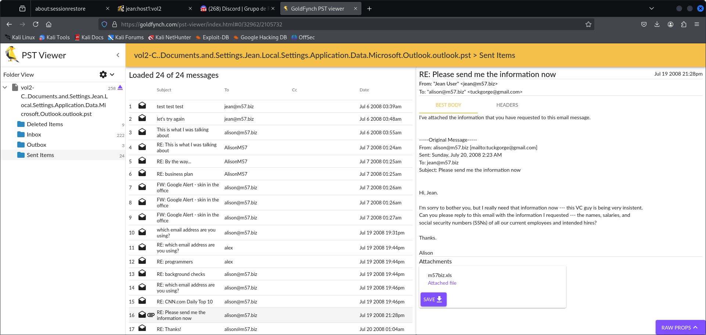

# Ejercicio Digital Corpora "Jean"

En este caso vamos a tener que investigar acerca de una situación bastante peliaguda en una "corporación virtual" llamada M57.biz, debido a esto la mayoría de archivos se transmiten a través de e-mails, lo cual nos va a ser de gran ayuda mientras analizamos todo lo sucedido.

El caso se basa en una filtración de documentos confidenciales, una spreadsheet fue posteada como un archivo en un foro de soporte técnico de la página web de un competidor.

Esta spreadsheet en concreto viene por parte del ordenador de Jean la directoria financiera.

(tenemos una copia del documento filtrado)

## Cuestiones a resolver

- Cómo llegó la spreadsheet a la página web del competidor?
- Cuando creó Jean el archivo
- Quién más en la compañia está envuelto en todo este lío

### Datos aparte proporcionados

- Tenemos una copia del disco duro de Jean
- Una copia de la spreadsheet
- EnCase

Según unos interrogatorios tenemos cierta información también, por ejemplo:

- Jean afirma que Allison la presidenta le pidió preparar la spreadsheet como parte de una nueva ronda de financiación y que se la enviase por email, no sabe nada más
- Allison asegura que no sabe de que está hablando Jean, niega habérselo pedido y niega haberla recibido.
- Correo de Allison: alison@m57.biz ; contraseña "ab=8989
- Correo de Jean: jean@m57.biz ; contraseña gick*1212

Con todos estos datos podemos ponernos manos a la obra.

## Autopsy

Abrimos un programa que nos va a ser muy útil llamado " Autopsy"

```bash
sudo autopsy
```
### Explicación de uso
- Primero creamos un nuevo caso dentro de la aplicacion, elegimos un nombre y un directorio
- Agregamos al caso la imagen con extension .E01 donde se encuentra toda la fuente de información, y seleccionamos el disco C: para comenzar a analizarlo
- Dado que sabemos que toda la información sensible que nos interesa va a provenir del correo buscamos un archivo con extension ".pst" para que mediante otra aplicación podamos visualizar la bandeja de entrada de Jean de forma muy cómoda.


Seguidamente cogemos el archivo .pst de Jean no el del admin y nos vamos a un PST viewer como bien he dicho antes

Exportamos el .pst y lo abrimos, dentro encontramos todas estas carpetas y correos, comienza la investigación


Bingo, en los correos enviados podemos ver como Jean le envia el archivo al supuesto correo de Allison respondiendo a un correo previo en el que efectivamente ella se lo pide



Pero esto tiene trampa, dado que el correo realmente está apuntando a otro:

```
tuckgorge@gmail.com
```
El impostor responde a Jean que gracias.

Viendo el nombre del archivo enviado por correo podemos buscarlo en Autopsy a ver cuando fue la fecha exacta de creación de la spreadsheet


Aqui lo tenemos, la fecha en la que se creo fue 2008-07-19 21:28:03


Y como podemos ver finalmente empiezan a mensajearse diciendo que el internet va mal, que algo raro esta pasando, algunos programadores preguntando que como saben su numero de la seguridad social que le están escribiendo acerca de ello.

Con esto podemos dar por resuelto el caso y todas las cuestiones expuestas, la fecha exacta de cuando se creo la spreadsheet, y lo que sucedió, que en pocas palabras Jean fue estafada por un hombre que se hacia pasar por su jefa, de ese modo la spreadsheet acabó en la página web de sus competidores.