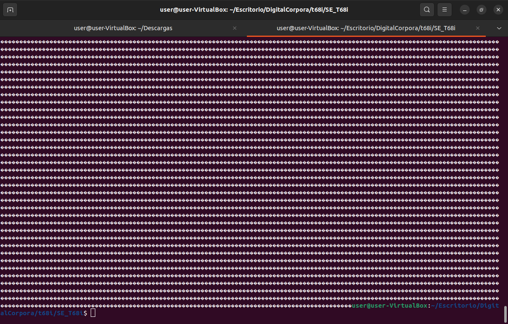
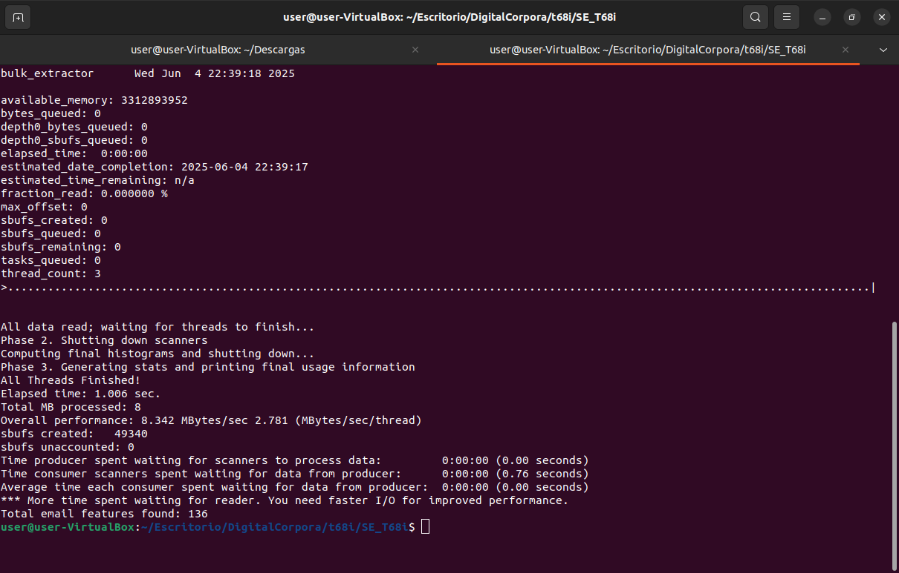
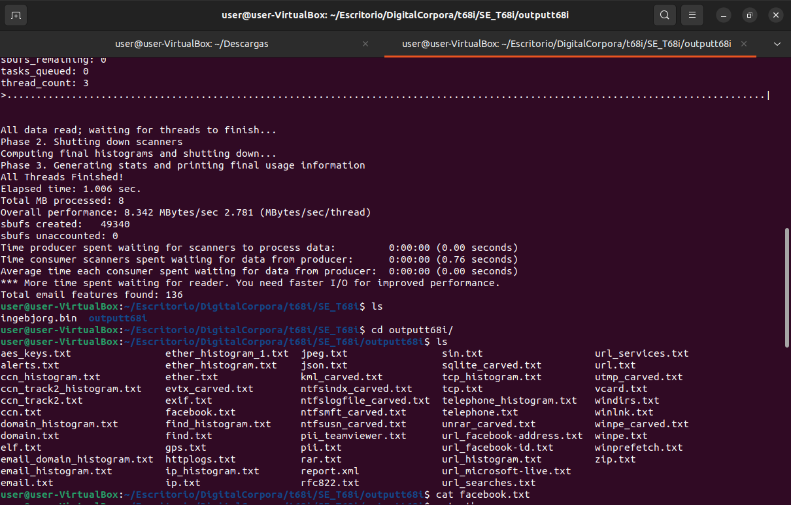
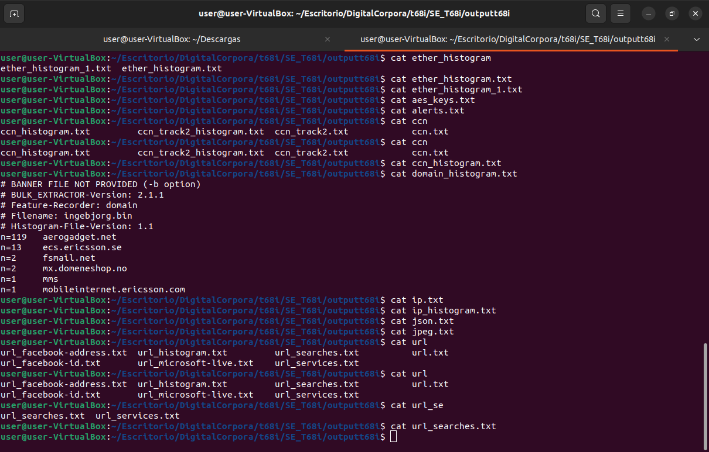

# Analisis forensico nokia t68i

En este ejercicio vamos a descargar los contenidos de un teléfono móvil y vamos a ver si somos capaces de acceder a sus archivos, correos...etc

Para ello después de habernos descargado el .zip de la página de Digital Corpora lo primero de todo es descomprimirlo.

```bash
unzip SE_t68i.zip
```
Nos devuelve una carpeta con el mismo nombre y dentro un archivo llamado "ingebjorg.bin"

```bash
cat ingebjorg.bin
```

Al hacerle un cat puedo comprobar que claramente es un binario por el tipo de contenido que devuelve.



Se puede hacer uso de varias herramientas pero esta vez voy a optar por el uso de bulk_extractor

```bash
bulk_extractor -o /home/user/Escritorio/DigitalCorpora/t68i/SE_T68i/outputt68i ingebjorg.bin
```



Nos saca todo el contenido a una carpeta que he nombrado como "outputt68i", empezamos a investigar un poco



Podemos ver como la mayoria de archivos estan completamente vacios, este en concreto contiene información

